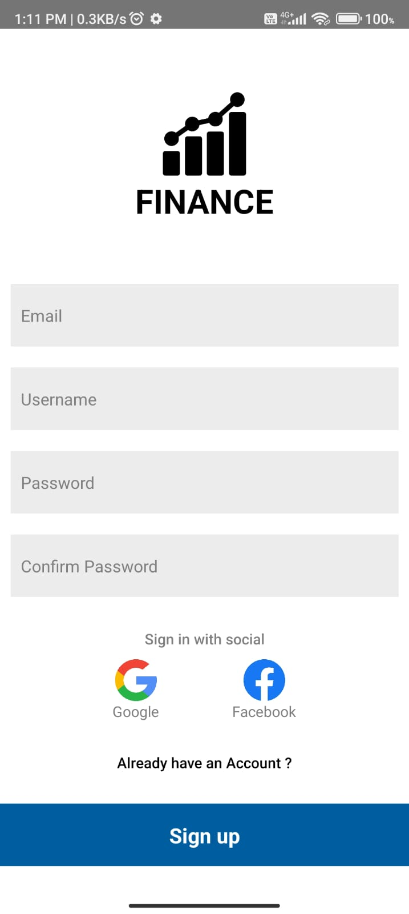
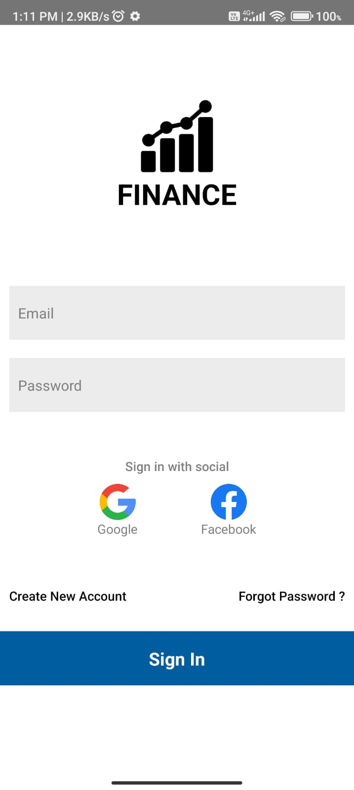

**Mobile Application to manage your finance.**

"Introducing the ultimate companion for smart financial management — our innovative Mobile Application to Manage Your Finance. Take charge of your financial journey like never before with a powerful, user-friendly app that empowers you to achieve your financial goals, track expenses, and make informed decisions effortlessly.

Experience the ease of managing your money on-the-go with our intuitive interface and robust features. Our app seamlessly syncs with your bank accounts, credit cards, and other financial sources, providing you with real-time insights into your financial health.

**Key Features:**

- Holistic Financial Overview: Get a comprehensive snapshot of your financial life in one place. See your account balances, investments, debts, and upcoming bills in a single, easily digestible dashboard.

- Expense Tracking: Say goodbye to manual expense tracking. Our app automatically categorizes your transactions, helping you understand where your money is going. Set budgets for different categories and receive notifications when you're approaching your limits.

- Budget Planning: Effortlessly create personalized budgets based on your income and financial goals. Our app provides actionable recommendations to help you save and spend wisely, ensuring you're always on track.

- Goal Setting: Define your short-term and long-term financial goals, whether it's buying a home, paying off debt, or planning a dream vacation. Our app helps you stay motivated by tracking your progress and suggesting strategies to achieve your objectives.

- Bill Management: Never miss a bill payment again. Our app sends reminders for upcoming bills and helps you organize due dates, ensuring your financial obligations are met promptly.

- Secure Transactions: Rest easy knowing your financial data is secure. We employ state-of-the-art encryption and security measures to protect your sensitive information.

- Investment Insights: Monitor your investments in real-time and receive personalized insights to optimize your portfolio. Stay informed about market trends and make informed decisions to grow your wealth.

- Customizable Reports: Generate visual reports that illustrate your spending patterns, income sources, and financial progress. Analyze your data to identify areas where you can make improvements.

**Authentication Screens:**

- Sign up Screen
  <!--  -->
  

- Sign in Screen
  <!--  -->
  

- Forgot Password Screen
  <!--  -->
  

- Verify OTP Screen
  <!--  -->
  

- New Password Screen
  <!--  -->
  

**Authenticated Screens:**

- Home Screen
  <!--  -->
  

- Income Screen
  <!--  -->
  

- Outcome Screen
  <!--  -->
  

- Profile Screen
  <!--  -->
  
